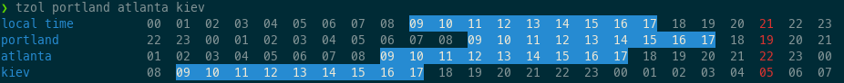

## About

`tzol` is a CLI utility that prints overlapping working hours across time zones.

## Usage

`tzol [city 1] [city 2] ... [city n]`

## Installing

This repo contains [binary releases](https://github.com/jamonette/tzol/releases/tag/1.0.0) for linux-x86 and macos-x86.

Other architectures can build from source via `cargo build --release`

## Implementation

In order to reduce runtime overhead, the city-timezone json map is parsed at build time
via the `build.rs` script, yielding a codegen'd source file placed into `src`.

`tzol` runs in under 5 milliseconds on old hardware

this is this first thing I've written in rust, so there may be room for improvement in this code :)

